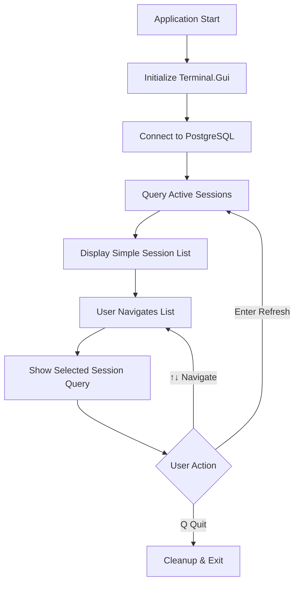

# PostgreSQL Database Monitor - Architecture Plan

## Project Overview
A Terminal User Interface (TUI) application for monitoring PostgreSQL database sessions. This is a read-only monitoring tool that displays active sessions, their current statements, and basic session information.

## Technology Stack
- **.NET 8.0** - Target framework
- **Terminal.Gui** - TUI framework for the user interface
- **Npgsql** - PostgreSQL .NET data provider
- **System.Text.Json** - For future configuration management

## MVP Connection Details
- **Host**: localhost
- **Database**: postgres
- **Port**: 5433
- **Username**: postgres
- **Password**: cenozon

## Project Structure
```
DbOps/
├── DbOps.csproj
├── Program.cs                 # Entry point
├── Models/
│   ├── DatabaseSession.cs    # Session data model
│   └── SessionDetails.cs     # Detailed session information
├── Services/
│   ├── PostgresService.cs    # Database connectivity and queries
│   └── SessionMonitor.cs     # Session monitoring logic
├── UI/
│   ├── MainWindow.cs         # Main TUI window
│   └── SessionListView.cs    # Simplified session list display
└── Queries/
    └── PostgresQueries.cs    # SQL queries for session monitoring
```

## Simplified UI Layout (MVP)
```
┌─ PostgreSQL Database Monitor ─────────────────────────────────────┐
│                                                                   │
│ Connected to: localhost:5433/postgres                             │
│                                                                   │
│ Active Sessions (5):                                              │
│                                                                   │
│ > [postgres] pgAdmin 4 - PID: 1234 - State: active              │
│   [postgres] psql - PID: 1235 - State: idle in transaction       │
│   [myapp] MyApplication - PID: 1236 - State: active              │
│   [myapp] Background Worker - PID: 1237 - State: active          │
│                                                                   │
│ Selected Session Details:                                         │
│ Current Query: SELECT * FROM users WHERE active = true...        │
│                                                                   │
│ [↑↓] Navigate | [Enter] Refresh | [Q] Quit                       │
└───────────────────────────────────────────────────────────────────┘
```

## Core Features for MVP

### 1. Database Connection Management
- Hardcoded connection to localhost:5433/postgres
- Connection validation and error handling
- Basic connection pooling through Npgsql

### 2. Session Monitoring
- Query active PostgreSQL sessions using `pg_stat_activity`
- Display sessions in a simple list format
- Show key session information inline:
  - Database name
  - Application/Program name
  - Process ID (PID)
  - Session state

### 3. Simplified TUI Interface
- **Main Window**: Single view with session list
- **Session Selection**: Navigate through sessions with arrow keys
- **Current Query Display**: Show selected session's current statement at bottom
- **Refresh**: Manual refresh with Enter key
- **Exit**: Quit with Q key

### 4. Session Details (Simplified)
- **Current Statement**: Display the currently executing SQL for selected session
- **Basic Info**: PID, state, database, application name inline in list

## Implementation Flow



## Key PostgreSQL Query

### Active Sessions Query (Simplified)
```sql
SELECT 
    pid,
    datname as database_name,
    application_name,
    state,
    query,
    query_start
FROM pg_stat_activity 
WHERE state != 'idle' 
    AND pid != pg_backend_pid()
ORDER BY datname, application_name;
```

## Data Models

### DatabaseSession Model (Simplified)
```csharp
public class DatabaseSession
{
    public int Pid { get; set; }
    public string DatabaseName { get; set; }
    public string ApplicationName { get; set; }
    public string State { get; set; }
    public string CurrentQuery { get; set; }
    public DateTime? QueryStart { get; set; }
}
```

## Development Phases

### Phase 1: Core Infrastructure
1. Create .NET 8.0 console project
2. Add Terminal.Gui and Npgsql NuGet packages
3. Implement basic PostgreSQL connection
4. Create simplified data model

### Phase 2: Basic TUI
1. Implement single main window with Terminal.Gui
2. Create simple session list view
3. Add basic navigation (up/down arrows)

### Phase 3: Session Monitoring
1. Implement PostgreSQL session query
2. Display active sessions in simple list format
3. Add session selection functionality

### Phase 4: Session Details
1. Show selected session's current SQL statement
2. Add refresh functionality (Enter key)
3. Add quit functionality (Q key)

## Error Handling Strategy
- **Connection Errors**: Display user-friendly messages for database connectivity issues
- **Query Errors**: Handle SQL exceptions gracefully with error messages
- **UI Errors**: Prevent crashes from Terminal.Gui exceptions
- **Graceful Degradation**: Show "No sessions" or "Connection lost" messages

## Key Simplifications for MVP
1. **Single View**: No separate detail windows or complex navigation
2. **Inline Information**: All key session info shown in the list itself
3. **Minimal Controls**: Just arrow keys, Enter, and Q
4. **Hardcoded Connection**: No configuration management initially
5. **Basic Refresh**: Manual refresh only, no auto-refresh
6. **Essential Data Only**: PID, database, application, state, current query

## Future Enhancements (Post-MVP)
- Configuration file management with encrypted passwords
- Multiple database connection support
- Auto-refresh functionality
- Wait event and locking information
- Session filtering and search
- More detailed session information views
- Export functionality
- Connection management UI

## Technical Notes
- Use Terminal.Gui's `ListView` for the session list
- Use `Label` widgets for connection info and selected query display
- Implement keyboard event handling for navigation and commands
- Use Npgsql's connection pooling for efficient database access
- Handle long SQL queries with truncation and scrolling